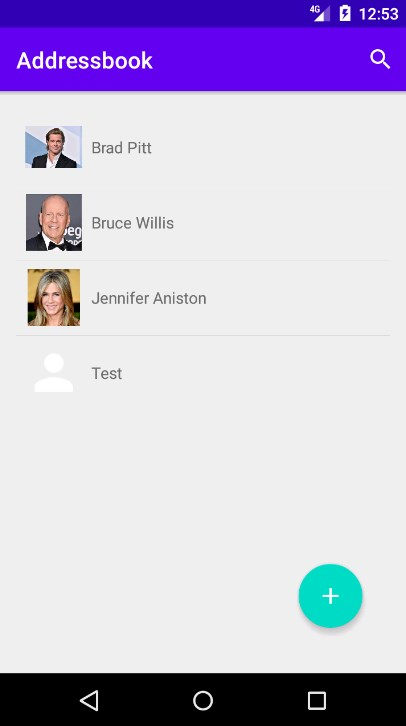

# AddressBook
Алфавитная записная книжка (приложение хранит контакты друзей, знакомых).

Идея приложения - из книги "П. Дейтел, Х. Дейтел, А. Уолд. Android для разработчиков. 3-е издание". (Глава 9).

Добавлены доп.возможности: сохранение фотографии контакта, отображение иконки фотографии в списке контактов, режим планшета.

