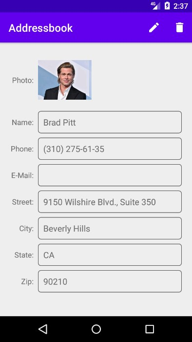
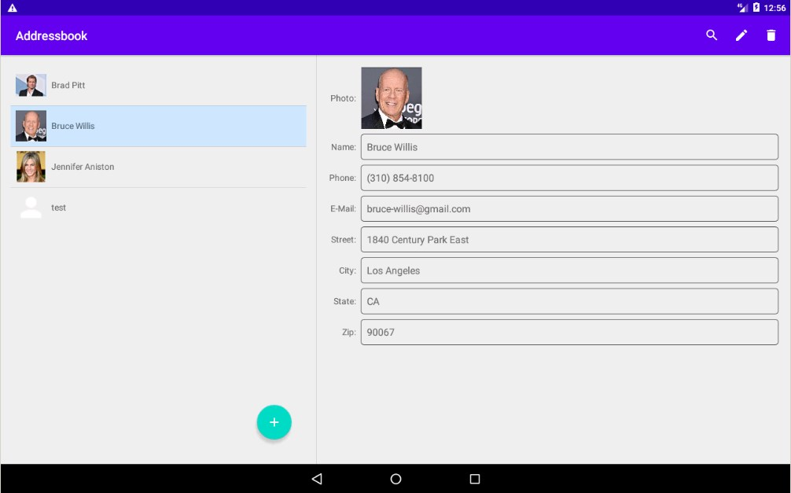
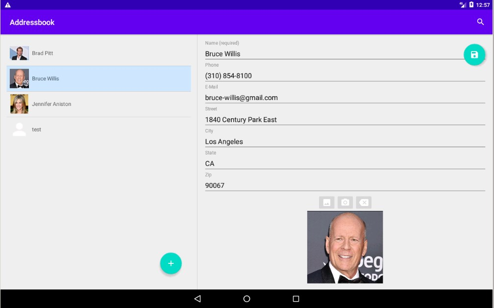

# AddressBook
Алфавитная записная книжка (приложение хранит контакты друзей, знакомых).

Идея приложения - из книги "П. Дейтел, Х. Дейтел, А. Уолд. Android для разработчиков. 3-е издание". (Глава 9).

Добавлены доп.возможности: сохранение фотографии контакта, отображение иконки фотографии в списке контактов, режим планшета.

рис.1 Главный экран.

---

рис.2 Просмотр контакта.

---

рис.3 Редактирование контакта.

---

рис.4 Удаление контакта.

---

рис.5 Просмотр фото контакта.

---

рис.6 Главный экран на планшете.

----

рис.7 Редактирование контакта на планшете.

----

рис.8 Поиск контакта на планшете.
